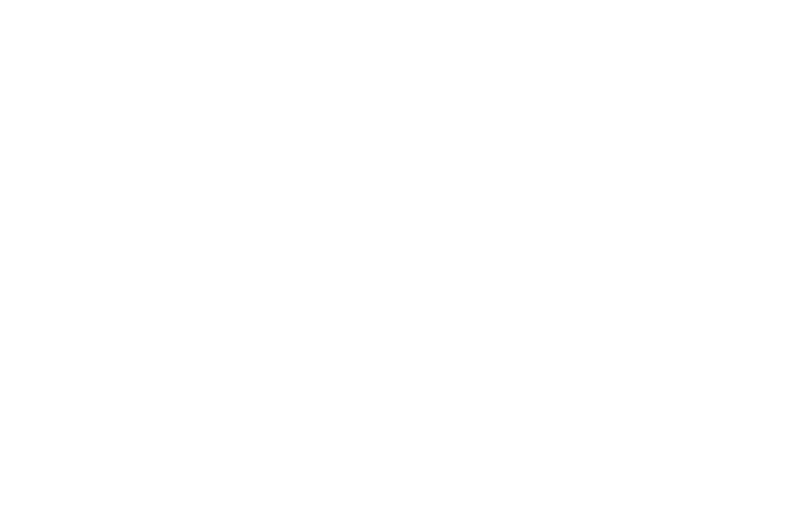
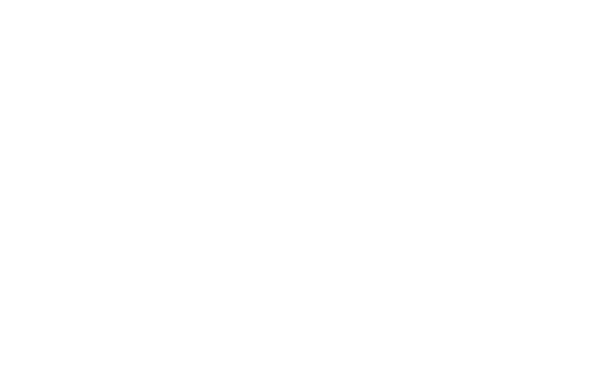
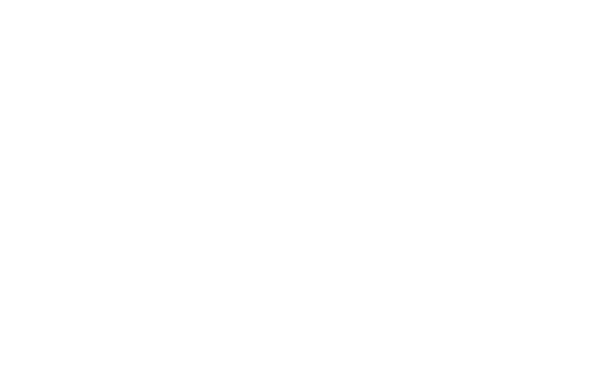
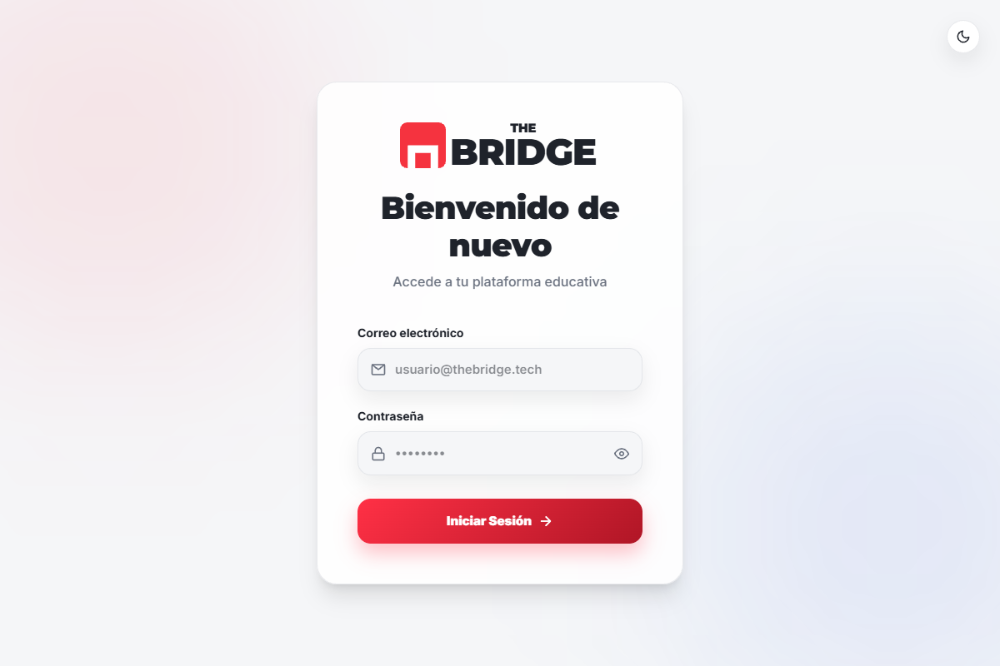

# 🎓 The Bridge Academy - E-Learning Platform

<div align="center">
  <p><em>Arquitectura Avanzada orientada a Rendimiento Extremo, DevSecOps y FinOps</em></p>

  
  
  
  
  
  
</div>

<br />

## 1. Visión General y Stack Tecnológico

The Bridge Academy es una plataforma LMS (Learning Management System) de última generación diseñada para maximizar el rendimiento y minimizar los costes operativos (Zero-Cost Architecture). Reemplaza el procesamiento tradicional en backend por computación descentralizada en el cliente.

**Stack Técnico Principal:**
* **Core Frontend:** React 19 (Hooks, Context, Lazy Loading), Vite, React Router DOM v7.
* **Estado y Caching:** React Query (TanStack Query v5) para sincronización asíncrona y estado de servidor.
* **Estilos y UI:** Tailwind CSS v4, Tailwind Typography, CSS Variables para theming dinámico (Dark/Light mode).
* **BaaS (Backend as a Service):** Firebase (Auth, Firestore) con reglas de seguridad granulares.
* **Procesamiento de Archivos:** PDF.js (v3) operando en Web Workers (Client-Side Parsing).
* **Seguridad y Parseo:** Zod (validación de esquemas), React Markdown + Rehype Sanitize (prevención XSS).
* **Testing:** Vitest + React Testing Library + JSDOM.

---

## 2. Arquitectura Global del Sistema

El sistema opera bajo un paradigma de **Desacoplamiento Estricto** y **Delegación al Cliente**:

1. **Capa de Presentación (UI):** Componentes funcionales aislados y de presentación, estilizados mediante utilidad-first (Tailwind).
2. **Capa de Orquestación (Hooks/Context):** Hooks personalizados (`useAuth`, `usePDFImport`) encapsulan la lógica de negocio y el ciclo de vida, sirviendo de puente entre la UI y los servicios. React Query maneja el caché de los datos asíncronos.
3. **Capa de Servicios y Modelos:** Patrón repositorio/servicio (`lecciones.service.js`) para abstraer completamente las interacciones de red con Firestore, apoyado por esquemas de datos (`schemas/`) para garantizar la integridad antes de cualquier mutación.
4. **Capa de Datos (Backend Serverless):** Firebase provee la autenticación basada en JWT y almacenamiento NoSQL particionado (subcolecciones masivas) para optimizar el FinOps de lectura.

---

## 3. Características Principales (Core Features)

* **Autenticación Basada en Roles (RBAC):** Flujo seguro manejado por `useAuth`. Redirección automática (`ProtectedRoute`) basada en el perfil del JWT (Administrador, Instructor, Alumno), inyectando el Layout (`AdminLayout`, `AlumnoLayout`) de forma perezosa (Lazy Loading).
* **Motor de Procesamiento PDF en Navegador:** Los instructores suben PDFs que son analizados bit a bit por `pdf.js` en el hilo secundario (Web Worker). Extrae texto limpio, evitando cuellos de botella en la red y almacenamiento en buckets S3 o Cloud Functions.
* **Lector Markdown Inmersivo:** Visor adaptativo (`VisorLeccion`) que convierte Markdown a HTML seguro en tiempo real, integrando un sticky progress bar interactivo.
* **Gestión Multi-Entidad:** Abstracciones completas para CRUD de Promociones, Alumnos, Profesores, Módulos y Lecciones.

---

## 4. Patrones de Diseño Aplicados

* **Separation of Concerns (SoC):** La vista jamás realiza fetches directos. Invocan funciones del `service` o custom hooks.
* **Lazy Loading en Rutas:** En `App.jsx`, los layouts pesados y los dashboards se importan con `React.lazy()` y `<Suspense>`, logrando que el bundle inicial (login) sea ultraligero y el TTI (Time to Interactive) casi instantáneo.
* **Patrón Factory / DTO:** Los modelos (`models/`) instancian objetos estándar antes de ser devueltos a la interfaz, normalizando los tipos de datos que provienen de Firestore.
* **Subcolecciones de Carga Diferida (Lazy Fetching):** Los índices de lecciones nunca cargan el contenido Markdown masivo. El cuerpo de la lección reside en la subcolección `contenido/main` y solo se descarga bajo demanda al abrir la vista de lectura.

---

## 5. Estructura de Directorios

```text
src/
├── components/   # Componentes puros de presentación (UI compartida)
├── config/       # Inicialización del SDK de Firebase y variables de entorno
├── context/      # Estados globales (ThemeContext, DataContext)
├── hooks/        # Lógica de negocio reutilizable (useAuth, usePDFImport)
├── layouts/      # Estructuras de página base según rol (AdminLayout, etc.)
├── models/       # Normalización de datos (DTOs) recibidos desde la BBDD
├── pages/        # Vistas ruteables organizadas por dominio (admin, alumno, instructor)
├── schemas/      # Validaciones Zod estáticas de frontera
├── services/     # Controladores de red (APIs de Firebase abstractas)
├── utils/        # Funciones auxiliares puras y formateadores
└── __tests__/    # Suite de pruebas automatizadas (Vitest)
```

---

## 6. Seguridad y Rendimiento

* **Límite Duro en Memoria (Bloqueo 800 KB):** El hook `usePDFImport` inyecta asincronía en su bucle (Event Loop yielding) para no congelar la UI, e interrumpe el procesamiento si el tamaño del payload supera los 800 KB, previniendo DoS en cliente.
* **Sanitización Dinámica XSS:** Todo texto proveniente de la base de datos se filtra con `rehype-sanitize` en tiempo de montaje del DOM (Zero Trust).
* **FinOps con `{ source: 'cache' }`:** React y los servicios obligan a leer desde `IndexedDB` las lecciones pesadas previas, erradicando los costes de lecturas documentales redundantes en Firestore.
* **Reglas de Seguridad O(1):** El archivo `firestore.rules` emplea `match` directo contra `request.auth.uid`, sin funciones recursivas externas, asegurando máxima velocidad y cero riesgo de manipulación de payloads HTTP.
* **Supply Chain Seguro:** Los cMaps críticos requeridos por PDF.js no dependen de CDNs; están incrustados estáticamente en `/public/cmaps/`.

---

## 7. 📸 Interfaz de Usuario (Módulos Críticos)

### Visor de Lecciones (Vista Alumno)

> Entorno de lectura inmersivo libre de distracciones. Incluye barra de progreso de lectura (sticky progress), botón inteligente para retornar arriba, y una escala tipográfica diseñada para optimizar la retención cognitiva en pantallas de escritorio y móviles.

### Motor de Procesamiento (Vista Profesor)

> La extracción de documentos ocurre localmente de manera asíncrona (Event Loop yielding). Muestra un spinner de progreso interactivo informando de que el parseo en Web Workers está activo.

### Bloqueo Amigable por Límite de Memoria (FinOps & UX)

> Interceptor de interfaz empático: Si el documento extraído sobrepasa el límite seguro de 800 KB, aborta la subida y sugiere dividir el temario antes de llegar a Firestore.

### Autenticación Segura (Login)

> Puerta de enlace universal. Valida las credenciales JWT de Firebase y enruta estáticamente al Layout correspondiente de forma imperceptible gracias al prefetching.

---

## 8. Guía de Desarrollo y Despliegue

### Requisitos Previos
* Node.js v18+ y npm
* Firebase CLI (`npm install -g firebase-tools`)

### Configuración del Entorno Local

1. **Clonar repositorio e instalar dependencias:**
   ```bash
   git clone <repo-url>
   cd thebridge-academy
   npm install
   ```

2. **Variables de Entorno (`.env`):**
   ```env
   VITE_FIREBASE_API_KEY=dummy
   VITE_FIREBASE_AUTH_DOMAIN=dummy
   VITE_FIREBASE_PROJECT_ID=dummy
   VITE_FIREBASE_STORAGE_BUCKET=dummy
   VITE_FIREBASE_MESSAGING_SENDER_ID=dummy
   VITE_FIREBASE_APP_ID=dummy
   ```

3. **Ejecutar Suite de Testing (Vitest):**
   ```bash
   npm run test
   ```

4. **Levantar Entorno (Emuladores + React):**
   Para un entorno de desarrollo aislado (Cero Costes en Cloud):
   ```bash
   npm run emulators
   # En otra terminal:
   npm run dev
   ```
   La plataforma estará disponible en `http://localhost:5173`.

5. **Construcción para Producción:**
   ```bash
   npm run build
   ```
   Genera el bundle estático minificado en el directorio `/dist`, listo para ser servido por Firebase Hosting o Vercel.
