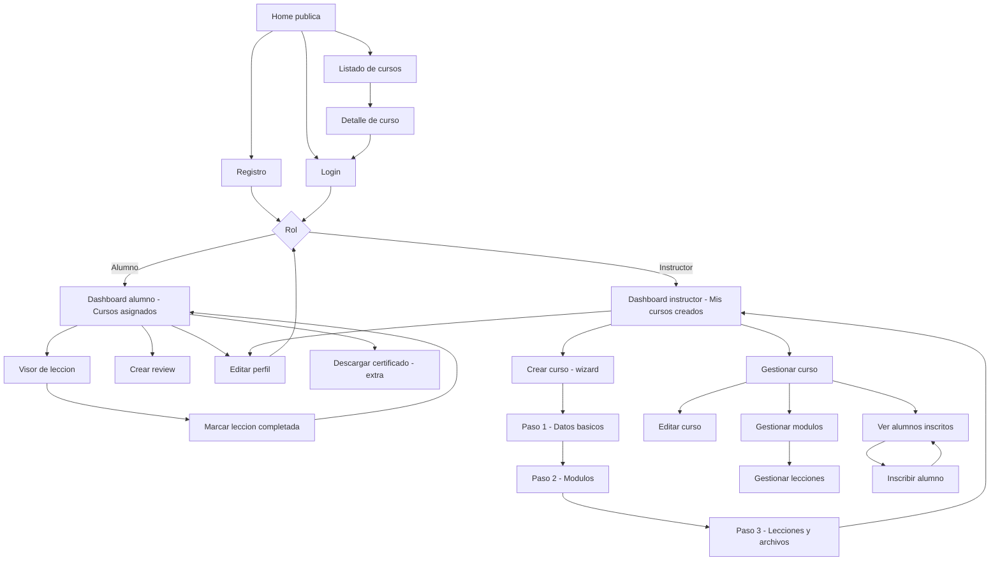

# Epica A - Producto y Diseno

## Objetivo

Definir las historias de usuario principales de AprenTIC Academy para los roles de instructor y alumno, separando el alcance MVP de los extras mediante priorizacion MoSCoW.

## Alcance del MVP

El MVP debe permitir demostrar el flujo principal de la plataforma de punta a punta:

- Registro, login, logout y sesion persistente con JWT.
- Diferenciacion de rol entre instructor y alumno.
- Listado publico de cursos con busqueda, filtros y paginacion.
- Detalle publico del curso con plan de estudios.
- Creacion y gestion de cursos, modulos y lecciones por parte del instructor.
- Subida de imagen de portada y archivo PDF de una leccion.
- Inscripcion de alumnos a cursos realizada por el instructor/profesor.
- Dashboard de alumno con cursos asignados y progreso por curso.
- Marcado de lecciones como completadas.
- Reviews de alumnos inscritos.
- Documentacion Swagger y README de arranque.

## Extras fuera del MVP

Estos elementos aportan valor, pero no bloquean la demo principal:

- Certificado PDF descargable al completar un curso.
- Subida de video a Cloudinary o S3.
- Modo claro/oscuro persistente.
- Internacionalizacion ES/EN.
- CI con GitHub Actions.
- Tests E2E con Cypress.
- Notificaciones tipo toast en toda la aplicacion.
- Panel avanzado de estadisticas del instructor.

## User stories priorizadas

| ID | Prioridad | Rol | User story | Resultado esperado |
| --- | --- | --- | --- | --- |
| US-01 | Must | Usuario | Como usuario quiero registrarme con email, contrasena, nombre y rol para poder acceder a la plataforma segun mi perfil. | El usuario queda creado y puede iniciar sesion. |
| US-02 | Must | Usuario | Como usuario quiero iniciar sesion con mis credenciales para acceder a mis pantallas privadas. | El sistema devuelve JWT y carga la sesion. |
| US-03 | Must | Usuario | Como usuario quiero cerrar sesion para proteger mi cuenta cuando termine de usar la plataforma. | El token se elimina y vuelvo al area publica. |
| US-04 | Must | Alumno | Como alumno quiero ver un listado publico de cursos para descubrir formaciones disponibles. | Se muestran cursos publicados con informacion basica. |
| US-05 | Must | Alumno | Como alumno quiero buscar y filtrar cursos por categoria, precio y valoracion para encontrar cursos relevantes. | El listado se actualiza con filtros y paginacion. |
| US-06 | Must | Alumno | Como alumno quiero entrar al detalle de un curso para revisar descripcion, instructor, modulos y lecciones para conocer el contenido disponible. | La pagina de detalle muestra el plan del curso sin permitir inscripcion directa. |
| US-07 | Must | Instructor | Como instructor quiero inscribir alumnos en mis cursos para controlar quien puede acceder al contenido privado. | Se crea una inscripcion asociando alumno y curso desde el panel del instructor. |
| US-08 | Must | Alumno | Como alumno quiero ver los cursos en los que mi profesor me ha inscrito para continuar mis formaciones desde un dashboard. | El dashboard muestra cursos asignados y porcentaje de avance. |
| US-09 | Must | Alumno | Como alumno quiero abrir una leccion y marcarla como completada para registrar mi progreso. | La leccion se marca y el porcentaje se recalcula. |
| US-10 | Must | Instructor | Como instructor quiero crear un curso con informacion basica para publicarlo en la plataforma. | El curso queda creado y asociado a mi usuario. |
| US-11 | Must | Instructor | Como instructor quiero organizar mi curso en modulos y lecciones para estructurar el aprendizaje. | Se pueden crear, editar y eliminar modulos y lecciones. |
| US-12 | Must | Instructor | Como instructor quiero subir una imagen de portada y un PDF de leccion para enriquecer el contenido del curso. | Los archivos se guardan y quedan accesibles desde la app. |
| US-13 | Must | Instructor | Como instructor quiero editar o eliminar solo mis propios cursos para mantener el control de mi contenido. | El backend valida propiedad y rol antes de modificar. |
| US-14 | Should | Alumno | Como alumno inscrito quiero valorar un curso con puntuacion y comentario para compartir mi experiencia. | La review se guarda una sola vez por alumno y curso. |
| US-15 | Should | Alumno | Como alumno quiero ver reviews y valoracion media de un curso para entender la calidad del contenido antes de empezarlo. | El detalle y listado muestran puntuacion media. |
| US-16 | Should | Instructor | Como instructor quiero ver alumnos inscritos y metricas basicas de mis cursos para entender su rendimiento. | El dashboard muestra inscritos, progreso agregado y valoracion media. |
| US-17 | Should | Equipo | Como equipo quiero documentar la API con Swagger para probar endpoints y facilitar la evaluacion. | `/api-docs` muestra la documentacion disponible. |
| US-18 | Should | Equipo | Como equipo quiero tener tests minimos de backend y frontend para validar los flujos criticos. | Existen al menos 3 tests backend y 3 frontend. |
| US-19 | Could | Alumno | Como alumno quiero descargar un certificado PDF al completar un curso para acreditar mi aprendizaje. | El certificado se genera al llegar al 100%. |
| US-20 | Could | Usuario | Como usuario quiero cambiar entre modo claro y oscuro para adaptar la interfaz a mis preferencias. | La preferencia queda guardada. |
| US-21 | Could | Usuario | Como usuario quiero recibir notificaciones visuales tras acciones importantes para saber si han salido bien o han fallado. | La app muestra mensajes de exito/error. |
| US-22 | Could | Equipo | Como equipo quiero ejecutar CI en cada pull request para detectar errores antes de integrar cambios. | GitHub Actions ejecuta tests automaticamente. |
| US-23 | Won't | Usuario | Como usuario quiero pagos reales integrados para comprar cursos de pago. | No se implementa en esta entrega; el precio sera informativo. |
| US-24 | Won't | Alumno | Como alumno quiero mensajeria directa con instructores para resolver dudas. | No entra en el alcance del proyecto final. |

## Flujo de pantallas a alto nivel

## Pantallas MVP

| Pantalla | Acceso | Proposito |
| --- | --- | --- |
| Home publica | Todos | Presentar cursos destacados, categorias y llamadas a registro/login. |
| Listado de cursos | Todos | Buscar, filtrar y paginar cursos publicados. |
| Detalle de curso | Todos | Mostrar descripcion, instructor, temario y reviews sin permitir inscripcion directa al alumno. |
| Login | Todos | Iniciar sesion y redirigir segun rol. |
| Registro | Todos | Crear cuenta de alumno o instructor. |
| Dashboard alumno | Alumno | Ver cursos asignados por el instructor y progreso. |
| Visor de leccion | Alumno inscrito | Consumir contenido y marcar lecciones como completadas. |
| Review de curso | Alumno inscrito | Crear valoracion del curso. |
| Dashboard instructor | Instructor | Ver cursos creados, accesos de gestion, alumnos inscritos y estadisticas basicas. |
| Wizard crear curso | Instructor | Crear curso, modulos, lecciones y subir archivos. |
| Gestionar curso | Instructor propietario | Editar cursos, modulos y lecciones; inscribir o revisar alumnos del curso. |
| Perfil | Usuario autenticado | Actualizar nombre, bio y avatar. |

## Guia de estilo base para Figma

La guia de estilo se define en `docs/figma-style-guide` y toma como referencia todos los entregables de diseno ya existentes:

- `docs/wireframes`: estructura MVP en baja fidelidad, con grises para validar layout y jerarquia.
- `docs/figma-demo`: direccion visual de alta fidelidad, con rojo de marca, superficies blancas, fondo suave y componentes de producto.
- `docs/producto-diseno.md`: alcance funcional, roles y pantallas que condicionan los componentes reutilizables.

La guia consolida los tokens y componentes base que despues se traducen 1:1 a React. La version actual amplia el encuadre visual con fundaciones, estados, componentes y un ejemplo compuesto de dashboard:

- Paleta: rojo primario `#FF3045`, hover `#B01626`, tinta `#1F232B`, fondo `#F5F6F8`, superficies blancas y bordes `#D3D6DC`.
- Tipografia: Montserrat para marca y jerarquia; Inter para UI, formularios y lectura.
- Espaciado: escala basada en 4px (`4`, `8`, `12`, `16`, `24`, `32`, `48`, `64`).
- Componentes base: `Button`, `Card`, `Input` y `Navbar`, con variantes documentadas para Figma y props equivalentes en React.
- Ejemplo aplicado: composicion de dashboard alumno para validar cards, input, progreso y jerarquia visual en contexto real del MVP.

## Definition of Done de la epica

- Hay al menos 12 user stories redactadas en formato "Como... quiero... para...".
- Cada historia tiene prioridad MoSCoW.
- El MVP queda separado de extras y elementos fuera de alcance.
- El flujo de pantallas identifica rutas principales de alumno e instructor.
- Las pantallas MVP quedan listadas con acceso y proposito.
