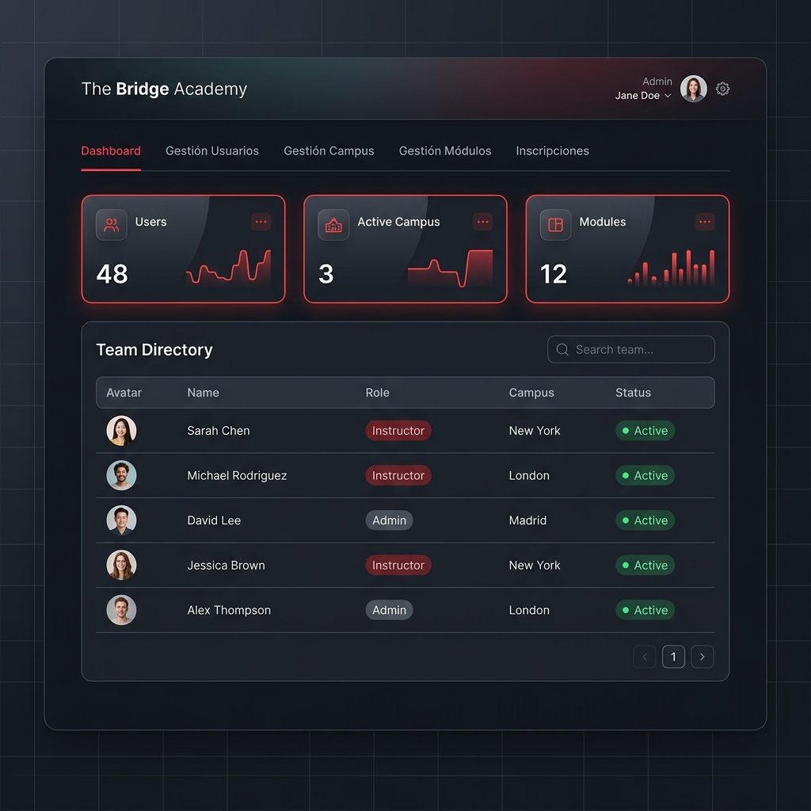
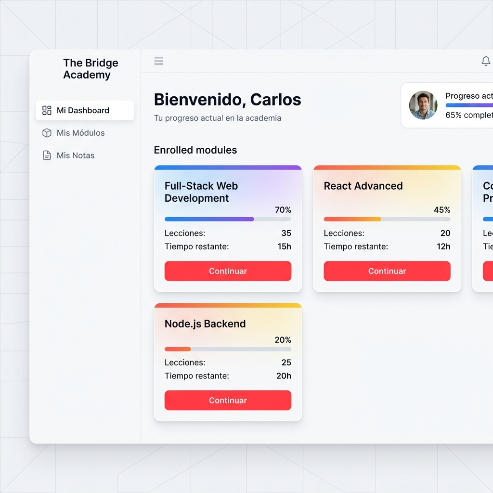
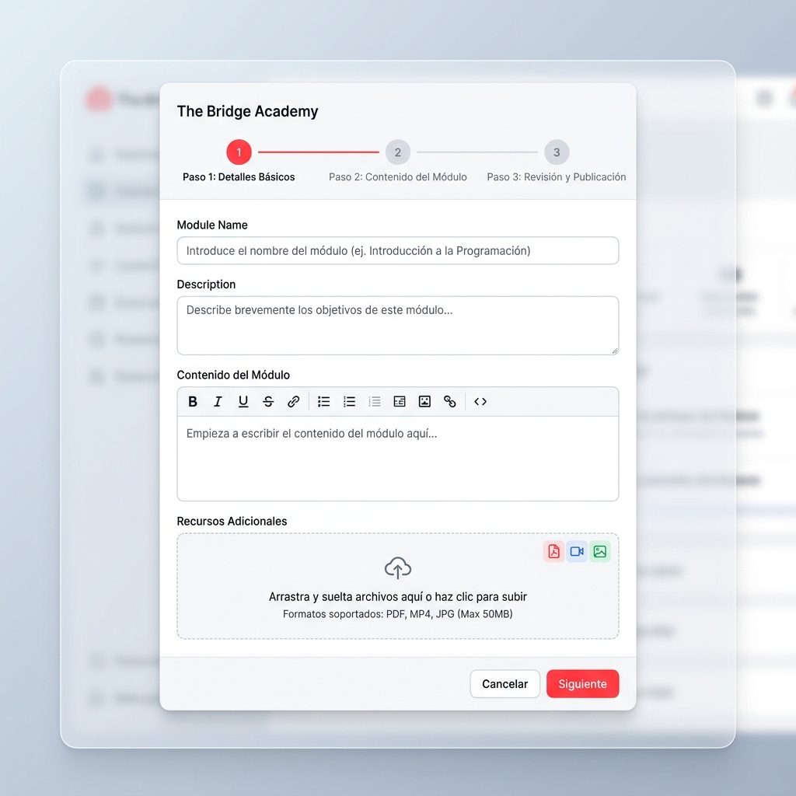
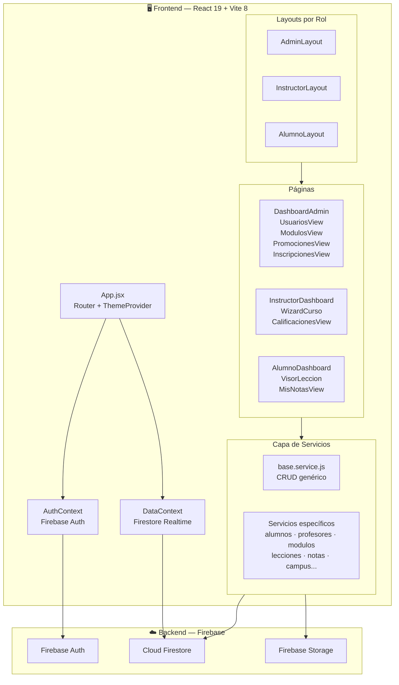
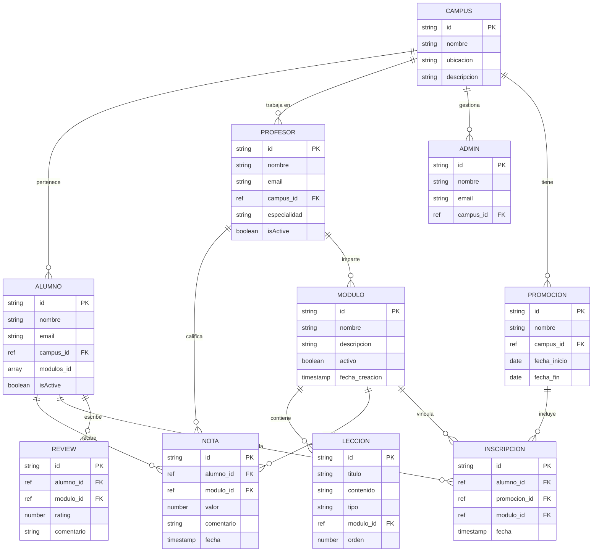
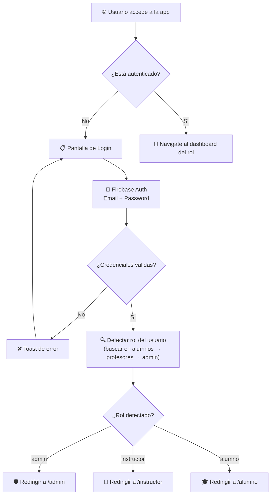
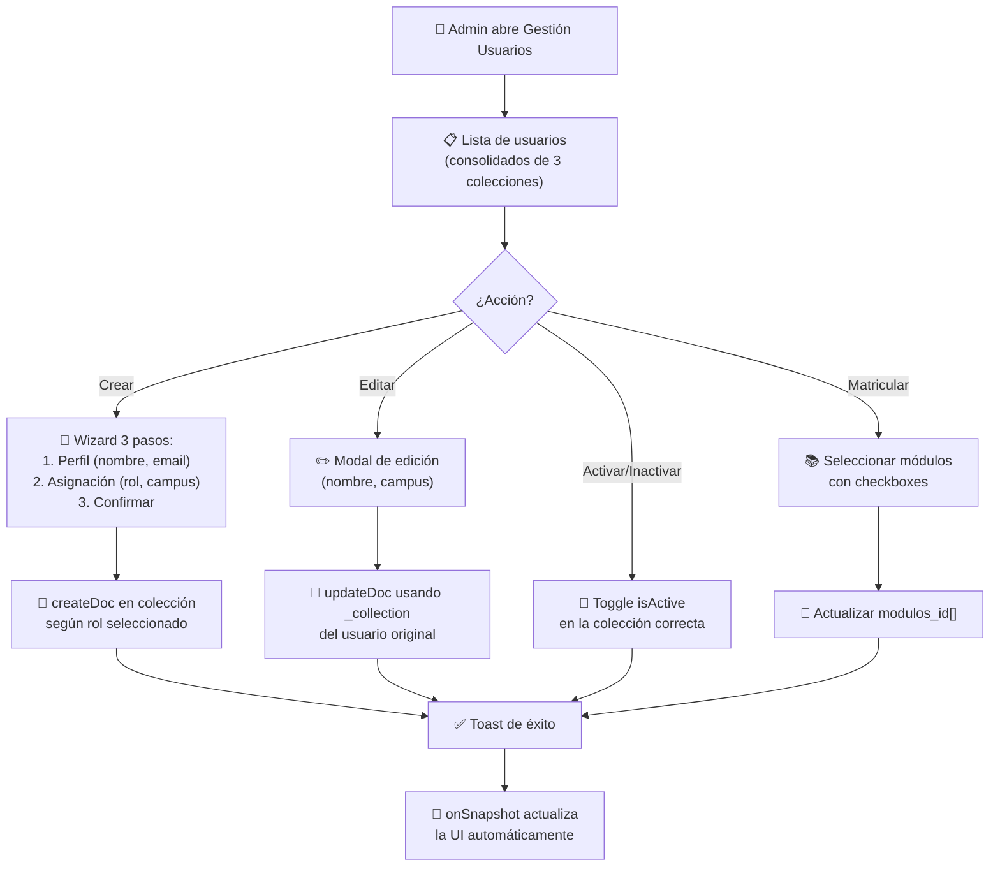
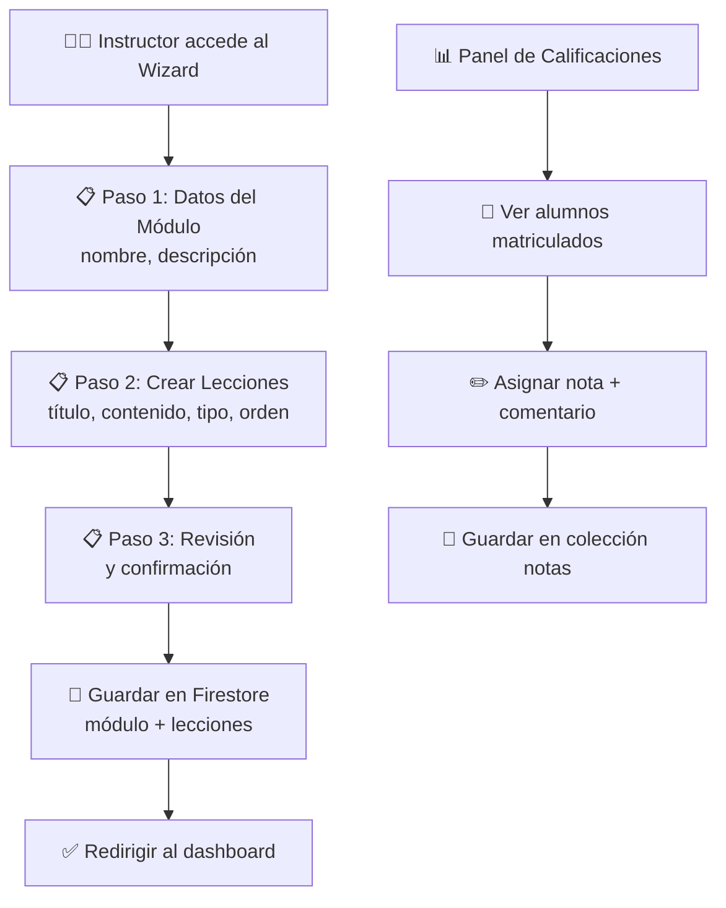
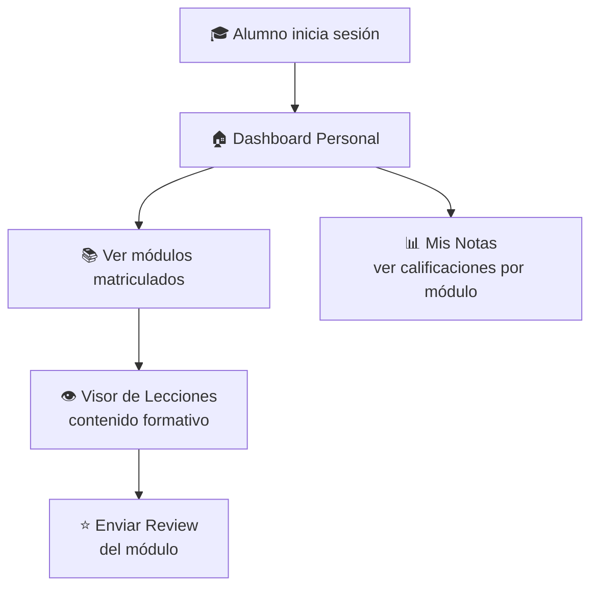
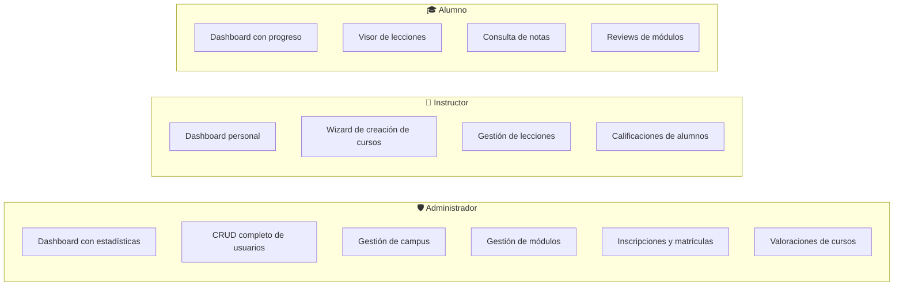

<div align="center">

# 🎓 The Bridge Academy

### Plataforma de Gestión Educativa — Full-Stack Web App

[](https://react.dev)
[](https://firebase.google.com)
[](https://vite.dev)
[](https://tailwindcss.com)
[](LICENSE)

*Un LMS (Learning Management System) moderno diseñado para academias de programación.*
*Gestiona campus, módulos, lecciones, calificaciones e inscripciones desde un único panel.*

</div>

---

## 📸 Capturas de Pantalla

<div align="center">

### Panel de Administración

*Panel principal del administrador con estadísticas en tiempo real, directorio de equipo y navegación por pestañas.*

### Panel del Alumno

*Vista del alumno con módulos matriculados, progreso y acceso directo a las lecciones.*

### Wizard de Creación de Cursos

*Asistente paso a paso para que instructores creen módulos y lecciones de forma intuitiva.*

</div>

---

## 🧩 Tabla de Contenidos

- [Características](#-características)
- [Arquitectura](#-arquitectura)
- [Tech Stack](#-tech-stack)
- [Estructura del Proyecto](#-estructura-del-proyecto)
- [Modelo de Datos](#-modelo-de-datos)
- [Flujos de Usuario](#-flujos-de-usuario)
- [Instalación](#-instalación)
- [Variables de Entorno](#-variables-de-entorno)
- [Scripts Disponibles](#-scripts-disponibles)
- [Roles y Permisos](#-roles-y-permisos)
- [Contribuir](#-contribuir)

---

## ✨ Características

| Módulo | Descripción |
|--------|-------------|
| 🔐 **Autenticación** | Login con Firebase Auth, roles automáticos, rutas protegidas |
| 👤 **Gestión de Usuarios** | CRUD completo (crear, editar, activar/inactivar) por colección Firestore |
| 🏫 **Gestión de Campus** | Crear y administrar sedes físicas de la academia |
| 📚 **Gestión de Módulos** | Wizard paso a paso para crear módulos con lecciones asociadas |
| 📝 **Lecciones & Visor** | Visor de lecciones con contenido enriquecido para alumnos |
| 📊 **Calificaciones** | Sistema de notas por alumno y módulo para instructores |
| 📋 **Inscripciones** | Gestión de matrículas (asignar módulos a alumnos) |
| ⭐ **Valoraciones** | Sistema de reviews/feedback por curso |
| 🌙 **Modo Oscuro** | Tema claro/oscuro con toggle persistente y paleta adaptativa |
| 🔔 **Notificaciones** | Toasts elegantes con `react-hot-toast` para feedback de acciones |

---

## 🏗️ Arquitectura



---

## 🛠️ Tech Stack

| Capa | Tecnología | Versión |
|------|-----------|---------|
| **Framework** | React | 19.x |
| **Bundler** | Vite | 8.x |
| **Estilos** | Tailwind CSS | 4.x |
| **Routing** | React Router DOM | 7.x |
| **Backend** | Firebase (Auth + Firestore + Storage) | 12.x |
| **Notificaciones** | react-hot-toast | 2.x |
| **Testing** | Vitest + Testing Library | 4.x |
| **Linting** | ESLint | 10.x |

---

## 📁 Estructura del Proyecto

```
TheBridge_Academy/
├── public/
│   └── logo.svg                    # Logo de la academia
├── src/
│   ├── App.jsx                     # Router principal + Providers
│   ├── main.jsx                    # Entry point
│   ├── index.css                   # Design system + tema claro/oscuro
│   │
│   ├── config/
│   │   └── firebase.js             # Configuración de Firebase
│   │
│   ├── context/
│   │   ├── AuthContext.jsx          # Autenticación + detección de rol
│   │   ├── DataContext.jsx          # Datos en tiempo real (onSnapshot)
│   │   └── ThemeContext.jsx         # Modo claro/oscuro persistente
│   │
│   ├── hooks/
│   │   └── useAuth.js              # Hook de autenticación
│   │
│   ├── layouts/
│   │   ├── AdminLayout.jsx          # Layout con nav de administrador
│   │   ├── InstructorLayout.jsx     # Layout con nav de instructor
│   │   ├── AlumnoLayout.jsx         # Layout con nav de alumno
│   │   └── ProtectedRoute.jsx       # Guard de rutas por rol
│   │
│   ├── models/                      # Clases de dominio (converters Firestore)
│   │   ├── Admin.model.js
│   │   ├── Alumno.model.js
│   │   ├── Campus.model.js
│   │   ├── Inscripcion.model.js
│   │   ├── Leccion.model.js
│   │   ├── Modulo.model.js
│   │   ├── Nota.model.js
│   │   ├── Profesor.model.js
│   │   ├── Promocion.model.js
│   │   ├── Proyecto.model.js
│   │   └── Review.model.js
│   │
│   ├── schemas/                     # Validación de datos
│   │   └── modulo.schema.js
│   │
│   ├── services/                    # Capa de acceso a datos (Firestore)
│   │   ├── base.service.js          # CRUD genérico (getAll, createDoc, updateDoc, deleteDoc)
│   │   ├── alumnos.service.js
│   │   ├── profesores.service.js
│   │   ├── admins.service.js
│   │   ├── modulos.service.js
│   │   ├── lecciones.service.js
│   │   ├── campus.service.js
│   │   ├── promociones.service.js
│   │   ├── inscripciones.service.js
│   │   ├── notas.service.js
│   │   ├── reviews.service.js
│   │   ├── proyectos.service.js
│   │   ├── roles.service.js
│   │   └── storage.service.js
│   │
│   ├── components/
│   │   ├── Login.jsx                # Pantalla de login
│   │   ├── Logo.jsx                 # Componente de logo
│   │   ├── Dashboard.jsx            # Dashboard genérico
│   │   ├── Card.jsx                 # Tarjeta reutilizable
│   │   ├── Input.jsx                # Input reutilizable
│   │   │
│   │   ├── forms/                   # Formularios modales
│   │   │   ├── CrearAlumnoForm.jsx
│   │   │   ├── CrearProfesorForm.jsx
│   │   │   ├── CrearModuloForm.jsx
│   │   │   ├── CrearLeccionForm.jsx
│   │   │   ├── CrearPromocionForm.jsx
│   │   │   └── ReviewForm.jsx
│   │   │
│   │   └── ui/                      # Componentes UI reutilizables
│   │       ├── Avatar.jsx
│   │       ├── Badge.jsx
│   │       ├── DataTable.jsx
│   │       ├── EmptyState.jsx
│   │       ├── LoadingScreen.jsx
│   │       ├── PageHeader.jsx
│   │       ├── StatCard.jsx
│   │       └── ThemeToggle.jsx
│   │
│   └── pages/
│       ├── AlumnosView.jsx          # CRUD de usuarios (admin)
│       ├── ProfesoresView.jsx       # Gestión de profesores
│       ├── PromocionesView.jsx      # Gestión de campus
│       ├── AdminModulosView.jsx     # Módulos (vista admin)
│       ├── ModulosView.jsx          # Módulos (vista instructor)
│       ├── LeccionesView.jsx        # Lista de lecciones
│       │
│       ├── admin/
│       │   ├── DashboardAdmin.jsx   # Panel principal admin
│       │   ├── ModulosView.jsx      # Gestión avanzada de módulos
│       │   ├── DirectorioTab.jsx    # Directorio por campus
│       │   ├── ValoracionesTab.jsx  # Reviews de cursos
│       │   └── InscripcionesView.jsx # Matrículas
│       │
│       ├── instructor/
│       │   ├── InstructorDashboard.jsx  # Panel del instructor
│       │   ├── WizardCurso.jsx          # Wizard creación de cursos
│       │   └── CalificacionesView.jsx   # Gestión de notas
│       │
│       └── alumno/
│           ├── AlumnoDashboard.jsx   # Panel del alumno
│           ├── VisorLeccion.jsx      # Visor de contenido
│           └── MisNotasView.jsx      # Consulta de notas
│
├── package.json
├── vite.config.js
└── README.md
```

---

## 🗃️ Modelo de Datos



### Colecciones Firestore

| Colección | Descripción | Campos clave |
|-----------|-------------|-------------|
| `alumnos` | Estudiantes matriculados | `nombre`, `email`, `campus_id` (ref), `modulos_id[]`, `isActive` |
| `profesores` | Instructores del equipo | `nombre`, `email`, `campus_id` (ref), `especialidad`, `isActive` |
| `admin` | Administradores del sistema | `nombre`, `email`, `campus_id` (ref) |
| `campus` | Sedes físicas de la academia | `nombre`, `ubicacion`, `descripcion` |
| `modulos` | Módulos formativos | `nombre`, `descripcion`, `activo`, `fecha_creacion` |
| `lecciones` | Contenido de cada módulo | `titulo`, `contenido`, `tipo`, `modulo_id` (ref), `orden` |
| `notas` | Calificaciones de alumnos | `alumno_id` (ref), `modulo_id` (ref), `valor`, `comentario` |
| `promociones` | Cohortes/Promociones | `nombre`, `campus_id` (ref), `fecha_inicio`, `fecha_fin` |
| `inscripciones` | Matrículas activas | `alumno_id`, `promocion_id`, `modulo_id`, `fecha` |
| `reviews` | Valoraciones de cursos | `alumno_id`, `modulo_id`, `rating`, `comentario` |

---

## 🔄 Flujos de Usuario

### Flujo de Autenticación



### Flujo CRUD de Usuarios (Admin)



### Flujo de Creación de Contenido (Instructor)



### Flujo del Alumno



---

## 🚀 Instalación

### Prerrequisitos

- **Node.js** ≥ 18.x
- **npm** ≥ 9.x
- Un proyecto de **Firebase** configurado con:
  - Authentication (Email/Password)
  - Cloud Firestore
  - Storage (opcional, para archivos)

### Pasos

```bash
# 1. Clonar el repositorio
git clone https://github.com/TheBridge-FullStackDeveloper/AprenTIC_Academy_-FullStack_Web_Sevilla_Group_1.git
cd AprenTIC_Academy_-FullStack_Web_Sevilla_Group_1/TheBridge_Academy

# 2. Instalar dependencias
npm install

# 3. Configurar variables de entorno (ver sección siguiente)
cp .env.example .env

# 4. Iniciar el servidor de desarrollo
npm run dev
```

La app estará disponible en `http://localhost:5173`.

---

## 🔑 Variables de Entorno

Crea un archivo `.env` en la raíz del proyecto `TheBridge_Academy/`:

```env
VITE_FIREBASE_API_KEY=tu_api_key
VITE_FIREBASE_AUTH_DOMAIN=tu_proyecto.firebaseapp.com
VITE_FIREBASE_PROJECT_ID=tu_proyecto_id
VITE_FIREBASE_STORAGE_BUCKET=tu_proyecto.firebasestorage.app
VITE_FIREBASE_MESSAGING_SENDER_ID=tu_sender_id
VITE_FIREBASE_APP_ID=tu_app_id
```

> ⚠️ **Nunca subas el archivo `.env` al repositorio.** Asegúrate de que está incluido en `.gitignore`.

---

## 📜 Scripts Disponibles

| Script | Comando | Descripción |
|--------|---------|-------------|
| **Dev** | `npm run dev` | Inicia Vite en modo desarrollo con HMR |
| **Build** | `npm run build` | Genera el bundle de producción en `dist/` |
| **Preview** | `npm run preview` | Sirve el build de producción localmente |
| **Lint** | `npm run lint` | Ejecuta ESLint sobre el proyecto |
| **Test** | `npm run test` | Ejecuta tests con Vitest |

---

## 🛡️ Roles y Permisos

La aplicación implementa un sistema de autorización basado en tres roles, cada uno con su propio layout, navegación y vistas:



| Ruta | Rol | Vista |
|------|-----|-------|
| `/admin` | Admin | Dashboard principal |
| `/admin/usuarios` | Admin | Directorio de usuarios (CRUD) |
| `/admin/campus` | Admin | Gestión de campus/promociones |
| `/admin/modulos` | Admin | Administración de módulos |
| `/admin/modulos/nuevo` | Admin | Wizard de creación de cursos |
| `/admin/inscripciones` | Admin | Gestión de matrículas |
| `/instructor` | Instructor | Dashboard del instructor |
| `/instructor/wizard` | Instructor | Wizard de creación de cursos |
| `/instructor/modulos` | Instructor | Mis módulos |
| `/instructor/lecciones` | Instructor | Mis lecciones |
| `/instructor/notas` | Instructor | Calificaciones |
| `/alumno` | Alumno | Mi dashboard |
| `/alumno/visor/:id` | Alumno | Visor de lecciones |
| `/alumno/notas` | Alumno | Mis notas |

---

## 🎨 Sistema de Diseño

La aplicación usa un **Design System personalizado** definido en `index.css` con variables CSS dinámicas que se adaptan automáticamente al modo claro/oscuro:

| Token | Modo Claro | Modo Oscuro |
|-------|-----------|-------------|
| `--brand-primary` | `#FF3045` | `#FF3045` |
| `--canvas` | `#F5F6F8` | `#09090B` (Zinc 950) |
| `--surface` | `rgba(255,255,255,0.85)` | `rgba(39,39,42,0.85)` (Zinc 800) |
| `--surface-solid` | `#FFFFFF` | `#27272A` (Zinc 800) |
| `--ink` | `#1F232B` | `#F8FAFC` |
| `--border` | `rgba(211,214,220,0.5)` | `rgba(255,255,255,0.15)` |
| `--text-primary` | `var(--ink)` | `#FFFFFF` |

### Tipografía

- **Headings:** Montserrat (800/900)
- **Body:** Inter (400–900)

---

## 🤝 Contribuir

1. Haz un **fork** del repositorio
2. Crea una rama para tu feature: `git checkout -b feature/nueva-funcionalidad`
3. Realiza tus cambios y commitea: `git commit -m 'feat: nueva funcionalidad'`
4. Sube los cambios: `git push origin feature/nueva-funcionalidad`
5. Abre un **Pull Request** hacia `main`

### Convención de Commits

Seguimos [Conventional Commits](https://www.conventionalcommits.org/):

| Prefijo | Uso |
|---------|-----|
| `feat:` | Nueva funcionalidad |
| `fix:` | Corrección de bug |
| `docs:` | Documentación |
| `style:` | Cambios de estilo (no funcionales) |
| `refactor:` | Refactorización de código |
| `test:` | Tests |

---

## 👥 Equipo

Desarrollado por el **Grupo 1 — Full-Stack Web Sevilla** de [The Bridge](https://www.thebridge.tech/).

---

<div align="center">

**Hecho con ❤️ y mucho ☕ en Sevilla**

*The Bridge Academy · 2025-2026*

</div>
